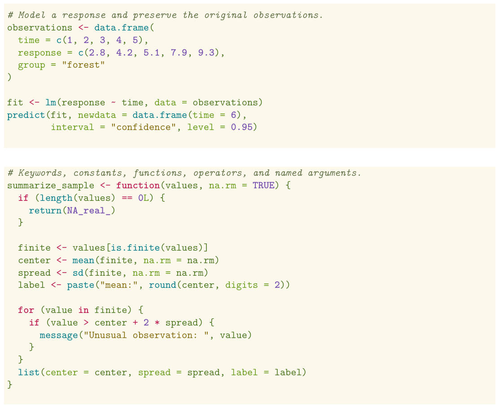

# R Markdown PDF Template

This repository is a small R Markdown template for polished PDF notes, homework, and handouts. It keeps the writing file in `Rmd Files/template.Rmd`, shared LaTeX setup in `lib/`, and editor/render helpers in `knit/`.

## Quick Start

1. Clone the repository.
2. Open `template.Rproj` in RStudio, or open the folder in Zed/VS Code.
3. Edit `Rmd Files/template.Rmd`.
4. Set the document title and author in the YAML header:

```yaml
header-includes:
  - \renewcommand{\mytitle}{Your Title}
  - \renewcommand{\myauthor}{Your Name}
```

5. Knit the document.

The default output file is `output.pdf` in the project root. That file is ignored by Git so rendered PDFs do not get committed by accident.

## Requirements

You need a working R installation with `rmarkdown` and a LaTeX distribution that can render PDF output with `pdflatex`.

The sample template loads these R packages:

```r
library(ggplot2)
library(dplyr)
library(gridExtra)
library(snazzieR)
```

Install them with:

```r
install.packages(c("rmarkdown", "ggplot2", "dplyr", "gridExtra", "snazzieR"))
```

## Rendering

From RStudio, click Knit while `Rmd Files/template.Rmd` is open. The YAML header uses this custom knit function:

```yaml
knit: (function(input, encoding) {source("../knit/knit.R"); knit(input)})
```

From a terminal, run:

```sh
Rscript -e 'source("knit/knit.R"); knit("Rmd Files/template.Rmd")'
```

Zed users can run the `Knit Current Rmd` task. VS Code users can run the `Knit` task.

## What's Included

`Rmd Files/template.Rmd` is the main starter document. It includes a YAML header wired to the shared LaTeX header, a setup chunk, package imports, and examples of the custom proof-line environment.

`lib/in_header.tex` is the PDF header entry point. It loads the package list, custom commands, and document configuration.

`lib/packages.tex` contains LaTeX package imports for math, graphics, TikZ, layout, tables, boxes, colors, captions, and hyperlinks.

`lib/commands.tex` contains custom authoring tools:

- `\mytitle` and `\myauthor` metadata commands.
- `\UNsection`, `\UNsubsection`, and `\multiheading` heading helpers.
- `\highlight{...}` for green emphasized text.
- `\mathbox{color}{...}` for boxed display math.
- `proofline` for nested proof/explanation blocks with a vertical rule.
- TikZ helpers, custom bullets, circled enumerate labels, and table column types.

`lib/config.tex` contains document-wide styling:

- Page geometry and header/footer rules.
- The shared color palette.
- Display math spacing.
- Table spacing.
- Section formatting.
- Hate of Nature Light syntax highlighting for code chunks.

The code chunks use a light adaptation of Hate of Nature, with vivid leaf green and deeper pink, yellow, orange, violet, and cyan accents. The existing warm background (`#FCF9EC`) and footnote-sized code are preserved. Code colors are separate from the document's other color definitions.

| Syntax role | Color |
|---|---|
| Plain code | Grass green `#4B7620` |
| Comments and documentation | Moss `#627248`, italic |
| Keywords | Bright leaf green `#679B19`, bold |
| Control flow | Pink `#BF2056`, bold |
| Operators, assignment, and special characters | Pink `#BF2056` |
| Strings and characters | Ochre `#826A0C` |
| Variables | Burnt orange `#A94F0A` |
| Named arguments | Bright leaf green `#679B19` |
| Numbers and constants | Violet `#7850AF`, bold |
| Functions | Cyan `#007A87` |
| Built-ins, types, and imports | Bright leaf green `#679B19` |

Pandoc's R tokenizer determines each token category; identifiers it classifies as plain code use grass green. Brighter leaf green highlights keywords and named arguments.

Preview rendered with the shared LaTeX configuration:



`knit/knit.R` renders any Rmd in `Rmd Files/` to `output.pdf` in the project root.

`knit/knit-task.sh` is a Zed task wrapper. It only runs for `.Rmd` files inside `Rmd Files/`, prevents overlapping renders, and opens a small failure report if knitting fails.

`.zed/` and `.vscode/` include editor task/settings files for knitting the current Rmd.

## Typical Customization

For a new document, edit `Rmd Files/template.Rmd` directly or copy it to another `.Rmd` file inside `Rmd Files/`.

Update the title and author in the YAML header, then write using normal Markdown, LaTeX math, and the custom commands from `lib/commands.tex`.

If you need to change visual styling across every document, edit the files in `lib/` instead of repeating LaTeX in individual Rmd files.
